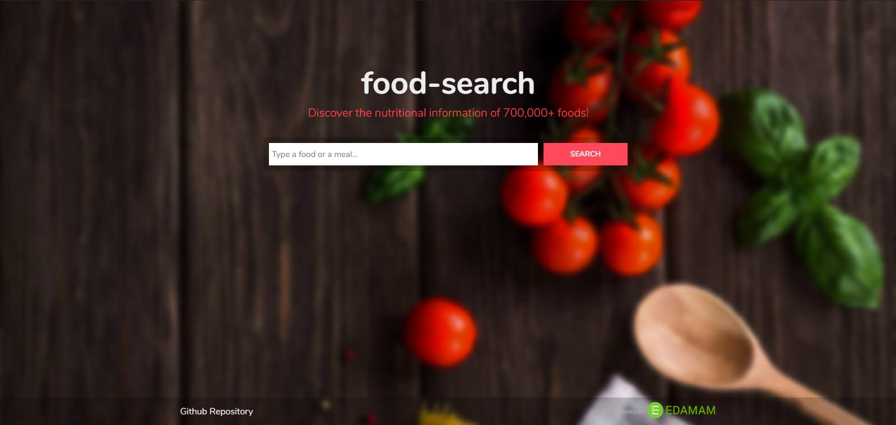

# food-search

> Discover the nutritional information of 700,000+ foods!

**food-search** is a *open-source* project which uses [Edaman API](https://developer.edamam.com/) to browse and retrieve the nutritional information and brand of any food or meal searched. The API contains a [Food Database](https://developer.edamam.com/food-database-api) with over 700,000 foods, restaurant items, fast foods and package foods.

[**Demo available here!**](http://food-search.surge.sh)

<p align="center">
  
</p>

## Using

First of all, you need to clone or download this repository.

```
git clone https://github.com/viniciusmeneses/food-search
```

Go to the **food-search** folder and install the dependencies

```
npm install
```

Run one of the following commands to start use **food-search**:

```
// Build and starts front-end and back-end servers
npm run dev

// Builds the application only
npm run build
```

<p align="center">
  <a href="https://developer.edamam.com/"></a>
</p>
